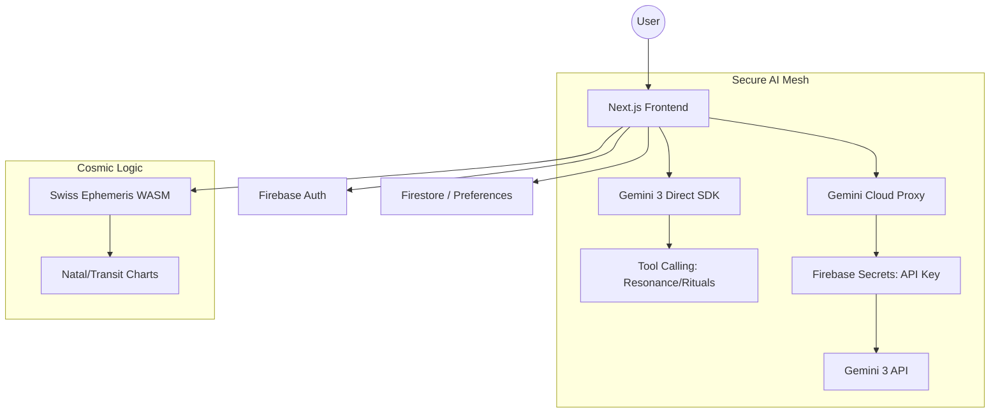

# 🌌 Celestia 3: The Astro-Numerical Nexus

[](https://deepmind.google/technologies/gemini/)
[](https://firebase.google.com/)
[](https://opensource.org/licenses/MIT)

**Celestia 3** is a production-grade spiritual-technical platform that bridges the gap between ancient esoteric wisdom and cutting-edge agentic AI. Powered by its own **Hybrid AI Mesh**, it transforms static coordinates into a living, interactive cosmic journey.

---

## ✨ Key Innovations

### 🧬 Bio-Link Rituals (Multi-Modal Vision)
Using **Gemini 3 Vision**, the "Aura Scanner" deciphers the vibrational resonance of your image to generate procedural aura artifacts, persistent Polaroid metadata, and poetic energy readings.

### 🤖 The Technomancer Assistant
A fully **Agentic Oracle** powered by Gemini 3's native tool-calling. It doesn't just provide insights—it autonomously triggers planetary resonance (Audio API), searches ethereal knowledge, and orchestrates complex rituals based on your natal signature.

### 🔢 Arithmancy & Precision Astrology
Integrates the **Swiss Ephemeris (WASM)** and a custom **Arithmancy Engine** to provide arc-second celestial accuracy and personalized daily vibrations.

---

## 📐 Architecture



---

## 🛠 Tech Stack

- **Frontend**: Next.js 15, React 19, Tailwind CSS, Framer Motion
- **AI**: Google Gemini 3 Pro Preview (Direct & Proxy-mediated)
- **Backend**: Firebase (Auth, Firestore, Hosting, Secrets, Functions)
- **Core Logic**: Swiss Ephemeris (WASM), Web Audio API (Aetheric Resonance)

---

## 📖 Explore Further

| Document | Description |
|----------|-------------|
| [**Technical Guide**](docs/TECHNICAL.md) | Deep dive into the AI Mesh, security model, and logic engines. |
| [**Feature Overview**](docs/FEATURES.md) | Conceptual guide to Rituals, Aura Scanning, and the Natal Compass. |
| [**Hackathon Readiness**](hackathon_readiness.md) | Audit against judging criteria and mandatory requirements. |

---

## 🚀 Getting Started

### Prerequisites
- Node.js 20+
- Firebase CLI
- Google Gemini API Key

### Installation

1. Clone the repository:
   ```bash
   git clone https://github.com/estevanhernandez-stack-ed/Celestia3.git
   cd Celestia3
   ```

2. Install dependencies:
   ```bash
   npm install
   ```

3. Setup environment variables:
   Create a `.env.local` file:
   ```env
   NEXT_PUBLIC_GEMINI_API_KEY=your_key_here
   NEXT_PUBLIC_FIREBASE_API_KEY=...
   ```

4. Run the development server:
   ```bash
   npm run dev
   ```

---

## 📜 License
This project is licensed under the MIT License - see the [LICENSE](LICENSE) file for details.

*Built for the Gemini 3 Hackathon 2026.*
