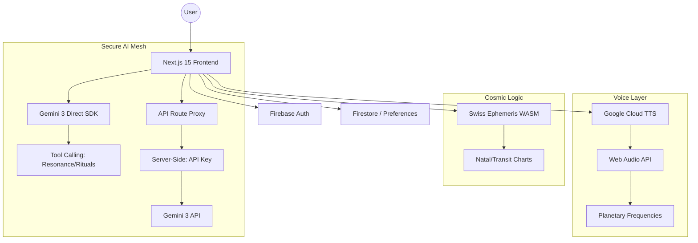

# 🌌 Celestia 3: The Astro-Numerical Nexus

<div align="center">

[](https://deepmind.google/technologies/gemini/)
[](https://firebase.google.com/)
[](https://nextjs.org/)
[](https://www.typescriptlang.org/)
[](https://opensource.org/licenses/MIT)

**A production-grade spiritual-technical platform that bridges ancient esoteric wisdom with cutting-edge agentic AI.**

[🚀 Live Demo](https://celestia3.web.app) • [📖 Documentation](docs/TECHNICAL.md) • [🎥 Video Walkthrough](#video-demo)

</div>

---

## 🎥 Video Demo

> *Click title to view demo*

---

## ✨ What Makes Celestia 3 Unique?

Celestia 3 isn't just another astrology app—it's a **multimodal agentic environment** where astronomical precision meets the ethereal. Built from the ground up for the **Gemini 3 Hackathon 2026**.

| Feature | Description |
|---------|-------------|
| 🔮 **Agentic Oracle** | Gemini 3 native tool-calling for autonomous insights |
| 📷 **Aura Scanner** | Vision AI analyzes your energy field in real-time |
| 🌟 **NASA-Grade Precision** | Swiss Ephemeris WASM for arc-second accuracy |
| 🎵 **Astral Resonance** | Web Audio API generates planetary frequencies |
| 🎴 **78-Card Tarot** | Complete Rider-Waite deck with AI interpretations |
| 🔢 **Arithmancy Engine** | Pythagorean & Chaldean numerology calculations |

---

## 🧬 Core Features

### 🤖 The Athanor (Agentic AI Oracle)
A fully **autonomous AI assistant** powered by Gemini 3's native tool-calling. It doesn't just answer questions—it:
- Triggers planetary resonance audio based on your chart
- Searches the ethereal knowledge base
- Orchestrates complex multi-step rituals
- Adapts its personality to your cosmic profile

### 📷 Aura Scanner (Multi-Modal Vision)
Using **Gemini 3 Vision**, the Aura Scanner:
- Analyzes your image for vibrational resonance
- Generates procedural aura artifacts
- Creates persistent Polaroid-style captures
- Poetic energy readings saved to your Grimoire

### 🔭 Natal Compass (Astronomical Engine)
- **Swiss Ephemeris WASM** for sub-arcsecond planetary positions
- Interactive 3D celestial visualization
- Real-time transit tracking
- House system calculations (Placidus, Whole Sign, Koch)

### 🎴 The Tarot Archive
- Complete 78-card Rider-Waite-Smith deck
- Multiple spread types (Celtic Cross, Three Card, etc.)
- AI-powered contextual interpretations
- Readings saved to your personal Grimoire

### 🔢 Arithmancy (Numerology Engine)
- Life Path, Destiny, and Soul Urge calculations
- Daily Personal Day vibrations
- Pythagorean & Chaldean systems
- Master number recognition (11, 22, 33)

### 👥 Synastry (Compatibility)
- Compare two natal charts
- Aspect analysis between charts
- AI-generated compatibility insights
- Save partner/friend charts

---

## 📐 Architecture



---

## 🛠 Tech Stack

| Layer | Technology |
|-------|------------|
| **Frontend** | Next.js 15, React 19, TypeScript, Tailwind CSS, Framer Motion |
| **AI** | Google Gemini 3 Pro Preview (Direct SDK + Proxy), Vision API |
| **Backend** | Firebase (Auth, Firestore, Hosting, Functions) |
| **Astronomy** | Swiss Ephemeris (WASM), Custom Ephemeris Algorithms |
| **Audio** | Web Audio API, Google Cloud Text-to-Speech |
| **3D** | React Three Fiber, Three.js |

---

## 🚀 Getting Started

### Prerequisites
- Node.js 20+
- Firebase CLI (`npm install -g firebase-tools`)
- Google Gemini API Key

### Installation

```bash
# Clone the repository
git clone https://github.com/estevanhernandez-stack-ed/Celestia3.git
cd Celestia3

# Install dependencies
npm install

# Setup environment variables
# Create a .env.local file with:
GEMINI_API_KEY=your_gemini_key
NEXT_PUBLIC_FIREBASE_API_KEY=your_firebase_key
NEXT_PUBLIC_FIREBASE_AUTH_DOMAIN=your_project.firebaseapp.com
NEXT_PUBLIC_FIREBASE_PROJECT_ID=your_project_id
NEXT_PUBLIC_FIREBASE_STORAGE_BUCKET=your_project.firebasestorage.app
NEXT_PUBLIC_FIREBASE_MESSAGING_SENDER_ID=your_sender_id
NEXT_PUBLIC_FIREBASE_APP_ID=your_app_id

# Run the development server
npm run dev
```

Visit `http://localhost:3000` to start your cosmic journey.

---

## 📁 Project Structure

```
src/
├── app/                    # Next.js App Router pages
├── components/             # React components
│   ├── AuraScanner.tsx     # Vision AI aura analysis
│   ├── DashboardShell.tsx  # Main application shell
│   ├── NatalCompass.tsx    # Interactive chart visualization
│   ├── TarotDeck.tsx       # Tarot reading interface
│   └── onboarding/         # Onboarding experience
├── context/                # React contexts
│   ├── AuthContext.tsx     # Firebase authentication
│   └── SettingsContext.tsx # User preferences
├── lib/                    # Core services
│   ├── gemini.ts           # Gemini API integration
│   ├── SwissEphemerisService.ts  # Astronomical calculations
│   ├── ProgressionService.ts     # XP & leveling system
│   └── ChatService.ts      # Agentic chat orchestration
└── types/                  # TypeScript definitions
```

---

## 📖 Documentation

| Document | Description |
|----------|-------------|
| [**Technical Guide**](docs/TECHNICAL.md) | Deep dive into the AI Mesh, security model, and logic engines |
| [**Feature Overview**](docs/FEATURES.md) | Conceptual guide to all features |
| [**Architecture**](docs/design/ARCHITECTURE.md) | System design and data flow |
| [**API Services**](docs/technical/SERVICES.md) | Service layer documentation |

---

## 🏆 Hackathon Highlights

### Gemini 3 Integration Depth
- **Native Tool Calling**: Autonomous agent actions without explicit prompts
- **Vision Analysis**: Real-time aura and energy field interpretation
- **Streaming Responses**: Live text generation with animated typing
- **Context Awareness**: Chart-aware, personality-adaptive responses

### Innovation Points
- First astrology platform with **agentic AI capabilities**
- **Biometric aura scanning** using Vision AI
- **Planetary frequency synthesis** via Web Audio API
- **Gamified progression system** with XP and unlockable features

---

## 📜 License

This project is licensed under the MIT License - see the [LICENSE](LICENSE) file for details.

---

<div align="center">

**Built with ✨ for the Gemini 3 Hackathon 2026**

*"The stars don't just tell your story—they become it."*

</div>
