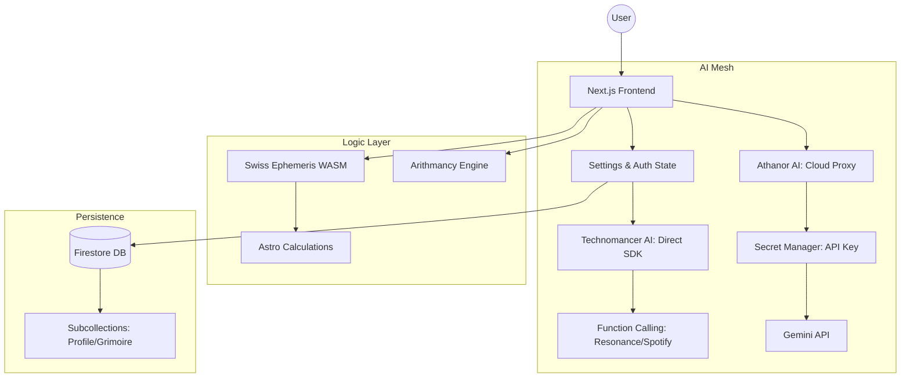

# 🏗️ System Architecture: Celestia 3 🌌🧪

Celestia 3 is a hybrid cloud-native application that orchestrates ancient esoteric logic with state-of-the-art Generative AI. 

## 📐 Conceptual Model

---

## 🦾 Component Breakdown

### 1. The Hybrid AI Mesh
To ensure security and power, we utilize two distinct AI pathways:
- **Technomancer (Direct):** Uses the client-side SDK for **Function Calling**. This allows "The Architect" to interact with browser APIs like Web Audio for rituals.
- **Athanor (Proxy):** Routes standard chat and generative tasks through a Firebase Cloud Function. This protects API keys and enforces server-side rate limits (20 req/min).

### 2. Ethereal WASM Bridge
Astrological precision is achieved via the `Swiss Ephemeris`, compiled to WebAssembly (WASM).
- **Communication:** Uses a direct memory bridge to fetch planetary longitude and house cusps from the C core.
- **Aspect Engine:** A separate TypeScript layer that calculates geometric relationships (squares, trines) between natal and transit coordinates.

### 3. State & Persistence
- **Local-First:** The app remains functional in "Guest Mode" using `localStorage` for temporary state.
- **Firestore Sync:** Authenticated sessions use `UserProfileService` to bidirectionally sync preferences, leveling, and the Grimoire.

---

## 🛡️ Security Architecture
- **Identity:** Managed via Firebase Auth.
- **Verification:** Firebase App Check (reCAPTCHA Enterprise) protects the Cloud Proxy from non-browser traffic.
- **Secrets:** API keys are never bundled in the frontend; they reside exclusively in **Google Cloud Secret Manager**.

---

## 📈 Progression & Logic
Access to advanced features (e.g., Synastry, Rituals) is gated by the `ProgressionService`.
- **XP Hooks:** Every significant interaction (reading, ritual, scan) triggers a server-side verified or client-calculated XP gain.
- **Level Gates:** Defined in `src/lib/ProgressionService.ts`, ensuring a curated user journey.
